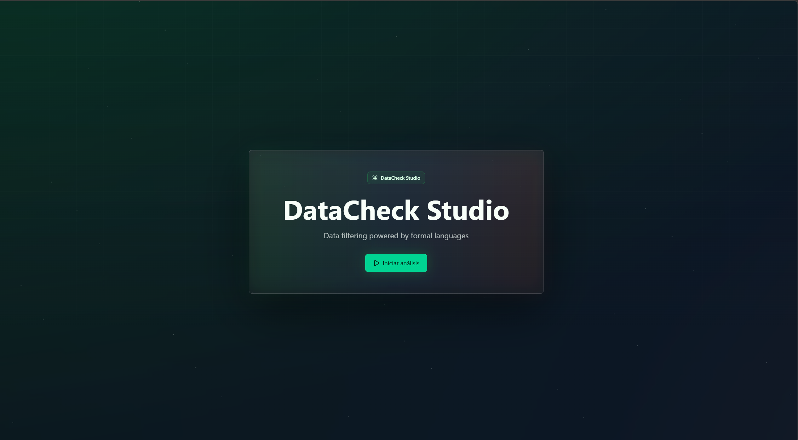
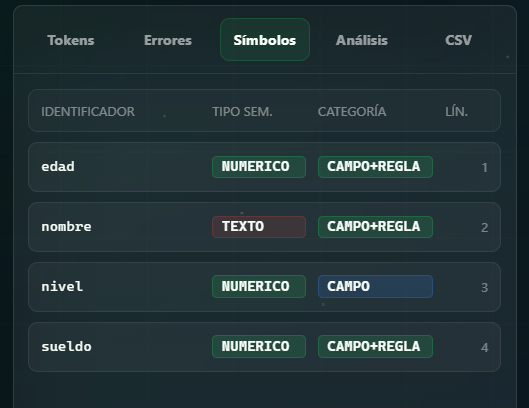
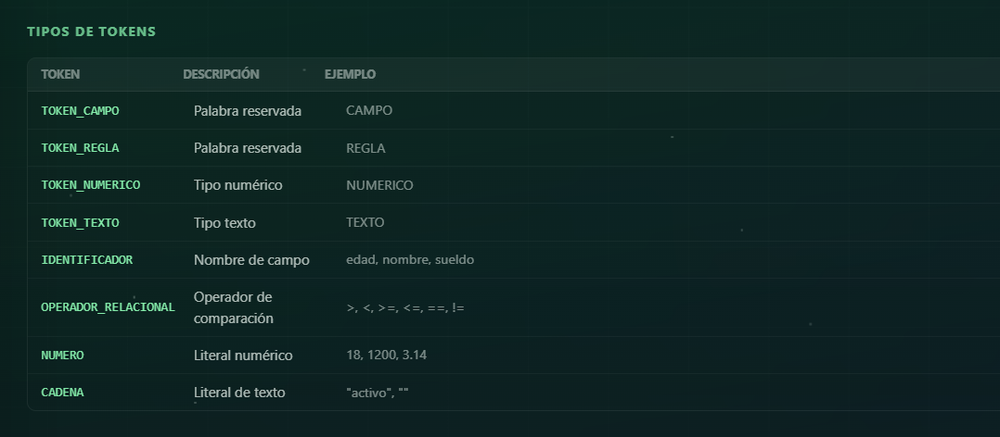
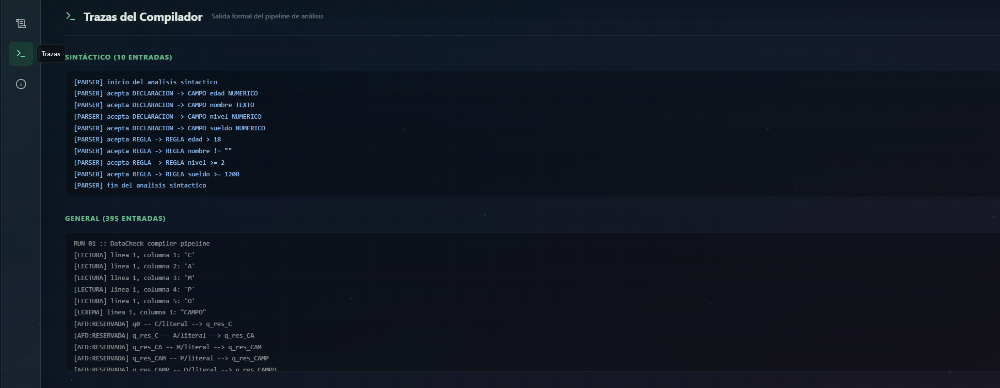
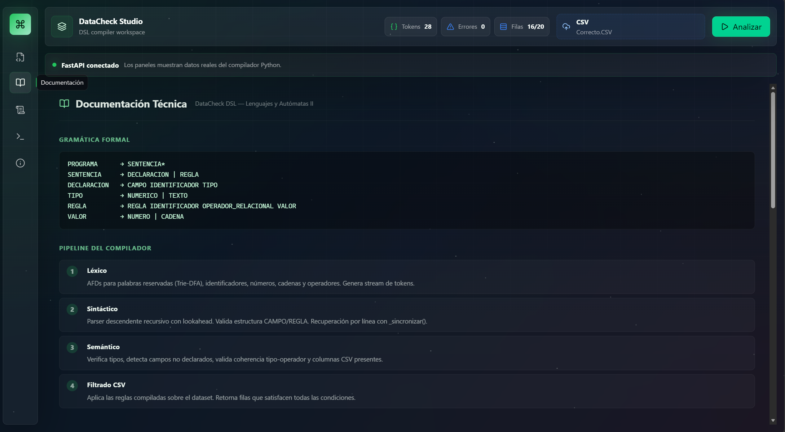

<div align="center">

# DataCheck Studio

### Compilador académico para un DSL de validación y filtrado de archivos CSV

<p align="center">


</p>

<br>

<a href="https://datacheck-dsl-compiler.vercel.app" target="_blank">


</a>

<br><br><br>



</div>

<br>

**Autor:** Jesús Grangeno García

**Institución:** Tecnológico Nacional de México (TECNM)

**Asignatura:** Lenguajes y Autómatas II

---

## Tabla de contenido

1. Introducción
2. Objetivos
3. Marco teórico
4. Arquitectura del proyecto
5. Análisis léxico
6. Análisis sintáctico
7. Análisis semántico
8. Ejecución sobre CSV
9. Frontend (DataCheck Studio)
10. Manejo de errores
11. Casos de prueba
12. Tecnologías utilizadas
13. Problemas encontrados y soluciones
14. Resultados obtenidos
15. Conclusiones
16. Trabajo futuro
17. Referencias

---

## 1. Introducción

### 1.1 Problema abordado

En entornos académicos, administrativos y empresariales, una tarea recurrente consiste en **filtrar grandes conjuntos de datos tabulares** (archivos CSV) aplicando reglas de validación expresadas en lenguaje natural. Por ejemplo: "obtener registros donde la edad sea mayor a 18 y el nombre no esté vacío". Sin una herramienta dedicada, este proceso suele resolverse con scripts ad hoc, fórmulas de hoja de cálculo o consultas SQL improvisadas, lo cual genera tres problemas:

1. **Falta de un lenguaje formal y reusable** para describir reglas de validación independientes de la herramienta de ejecución.
2. **Ausencia de retroalimentación clara** cuando la regla está mal escrita; los errores se descubren tarde, mezclados con problemas de los datos.
3. **Imposibilidad de inspeccionar el proceso interno** (tokenización, análisis, recuperación de errores) por motivos didácticos.

DataCheck Studio aborda este problema construyendo un **compilador académico completo** para un lenguaje de dominio específico (DSL) llamado **DataCheck DSL**, que permite declarar campos tipados y reglas de filtrado, y aplica esas reglas sobre un CSV cargado por el usuario.

### 1.2 Propósito del compilador

DataCheck DSL es un lenguaje deliberadamente reducido y formal, con dos tipos de sentencias:

```
CAMPO  <identificador>  <NUMERICO | TEXTO>
REGLA  <identificador>  <operador relacional>  <NUMERO | CADENA>
```

El propósito del compilador es:

- **Reconocer formalmente** cada lexema mediante autómatas finitos deterministas (AFD), uno por categoría léxica.
- **Validar la estructura** de las sentencias mediante análisis sintáctico descendente recursivo.
- **Verificar la coherencia semántica** entre declaraciones, reglas, tipos y, opcionalmente, las columnas del CSV.
- **Ejecutar las reglas compiladas** sobre el conjunto de filas para producir el subconjunto que satisface todas las condiciones.
- **Exponer la traza completa** del proceso (lectura caracter a caracter, transiciones de AFD, reducciones del parser, decisiones semánticas) para uso didáctico.

### 1.3 Objetivo académico

El proyecto materializa, en una sola aplicación funcional, los conceptos centrales de la asignatura *Lenguajes y Autómatas II*: implementación manual de autómatas, construcción de un analizador léxico sin bibliotecas externas de parsing, parser descendente con recuperación de errores, análisis semántico con tabla de símbolos, manejo formal de errores y separación de fases del compilador. Además, ofrece una interfaz visual moderna que expone cada artefacto generado (tokens, errores, tabla de símbolos, declaraciones, reglas, trazas, resultados CSV) como objeto inspeccionable.

### 1.4 Motivación

La motivación es triple:

1. **Pedagógica:** ningún módulo del compilador delega su lógica de reconocimiento a bibliotecas externas (no se usa `ply`, `lark`, `re` para tokenizar, etc.). El alfabeto, la lectura caracter a caracter, los AFD, la tabla de símbolos y la pila de errores se construyen explícitamente.
2. **Práctica:** el resultado final es una herramienta útil que filtra CSV reales mediante un DSL expresivo.
3. **Profesional:** la arquitectura cliente–servidor (FastAPI + React) refleja un patrón de diseño actual y profesionaliza la entrega del proyecto académico.

---

## 2. Objetivos

### 2.1 Objetivo general

Diseñar e implementar un compilador académico completo, de cuatro fases (léxica, sintáctica, semántica y de ejecución sobre datos), para un lenguaje de dominio específico orientado a la validación y filtrado de archivos CSV, integrado en una aplicación web con interfaz tipo IDE.

### 2.2 Objetivos específicos

1. Definir formalmente el **alfabeto Σ** del lenguaje DataCheck DSL y construir un módulo que clasifique cada caracter en una de las categorías reconocidas.
2. Implementar un **lector secuencial** que consuma el archivo fuente caracter por caracter con un único caracter de anticipación (`peek/read`).
3. Implementar **cinco autómatas finitos deterministas independientes**, uno por categoría léxica: palabras reservadas (Trie-AFD), identificadores, números, cadenas y operadores relacionales.
4. Construir un **analizador léxico** que coordine los AFD, alimente una **tabla de símbolos** y una **pila de errores léxicos** con códigos catalogados.
5. Implementar un **parser descendente recursivo** que consuma tokens del lexer y reconozca la gramática del DSL, con **recuperación de errores por sincronización a nivel de línea** para evitar errores en cascada.
6. Implementar un **analizador semántico** que valide:
   - Duplicidad de declaraciones de campo.
   - Existencia de los campos referenciados en las reglas.
   - Coherencia entre tipo del campo y tipo del literal de la regla.
   - Validez del operador relacional según el tipo del campo.
   - Existencia, opcionalmente, de la columna correspondiente en los encabezados del CSV.
7. Implementar un **motor de filtrado CSV** que aplique las reglas compiladas sobre el conjunto de filas y retorne las filas que satisfacen todas las condiciones.
8. Exponer el pipeline a través de una **API REST con FastAPI**, con endpoints diferenciados para análisis completo, tokens, errores, tabla de símbolos y filtrado.
9. Desarrollar un **frontend en React 19 + TypeScript + Vite** con apariencia de IDE: barra lateral, editor con resaltado de sintaxis basado en los tokens reales del backend, consola de trazas, pestañas de inspección y vistas de documentación y manual.
10. Producir **trazas formales** del proceso de compilación que puedan inspeccionarse desde la interfaz.

---

## 3. Marco teórico

### 3.1 Lenguajes formales

Un **lenguaje formal** L sobre un alfabeto Σ es un subconjunto de Σ*, donde Σ* denota la cerradura de Kleene de Σ (todas las cadenas finitas construibles, incluida la cadena vacía ε). En DataCheck, Σ es el conjunto de caracteres válidos definido en `lexer/alfabeto.py`: letras mayúsculas y minúsculas, dígitos, los operadores `> < = !`, el guion bajo, el punto, la comilla doble, los espacios y los saltos de línea. Cualquier caracter fuera de Σ produce un **error léxico 100**.

### 3.2 Compiladores

Un **compilador** transforma un programa fuente en una representación intermedia o ejecutable. Las fases clásicas son: análisis léxico, sintáctico, semántico, generación de código intermedio, optimización y generación de código objeto. En DataCheck, dado que el lenguaje no produce código ejecutable sino que **interpreta inmediatamente** las reglas sobre un CSV, el pipeline se simplifica a cuatro fases: léxica → sintáctica → semántica → ejecución (filtrado). Esta estructura es académicamente equivalente a un intérprete de un único paso, y respeta la separación estricta entre fases que exige la asignatura.

### 3.3 Análisis léxico

El análisis léxico convierte el texto fuente en una secuencia de tokens, donde cada token es una tupla `<lexema, token, tipo, valor, línea, columna>`. En DataCheck el lexer es **construido manualmente**: no usa expresiones regulares ni generadores. Cada token candidato se valida ejecutando el AFD correspondiente sobre el lexema acumulado.

### 3.4 Análisis sintáctico

El análisis sintáctico verifica que la secuencia de tokens cumpla una **gramática libre de contexto**. DataCheck usa una gramática extremadamente reducida (ver §6) y un parser descendente recursivo con lookahead acotado (consulta de hasta 3 tokens siguientes mediante `_mirar(desplazamiento)`).

### 3.5 Análisis semántico

El análisis semántico verifica propiedades que la gramática libre de contexto no puede expresar: existencia y unicidad de declaraciones, coherencia de tipos y compatibilidad entre operadores y operandos. Para ello mantiene una **tabla de símbolos enriquecida**.

### 3.6 Autómatas finitos deterministas (AFD)

Un AFD es una quíntupla M = (Q, Σ, δ, q₀, F) donde:

- Q es un conjunto finito de estados.
- Σ es el alfabeto de entrada.
- δ: Q × Σ → Q es la función de transición.
- q₀ ∈ Q es el estado inicial.
- F ⊆ Q es el conjunto de estados de aceptación.

En DataCheck cada AFD está implementado como una clase Python con:

- `estado_inicial: str`
- `estados_finales: dict | set`
- `transiciones: dict` (codifica δ como diccionario anidado `{estado: {categoría: estado_destino}}`)
- Método `evaluar(lexema, traza=None)` que recorre la cadena, aplica δ y retorna un `ResultadoAFD(aceptado, estado_final, token, tipo, motivo)`.

### 3.7 Tablas de símbolos

La tabla de símbolos almacena información sobre identificadores y otros elementos relevantes. En DataCheck existen **dos tablas distintas**:

1. **Tabla léxica** (`lexer/tabla_simbolos.py`): un registro por cada token aceptado por su AFD, con lexema, token, tipo, valor, línea y columna.
2. **Tabla semántica enriquecida** (construida en `_construir_tabla_simbolos` dentro de `backend/services/compiler_service.py`): se centra en identificadores únicos y agrega tipo semántico (`NUMERICO`, `TEXTO`, `NO_DECLARADO`) y categoría (`CAMPO`, `REGLA`, `CAMPO+REGLA`, `NO_DECLARADO`).

### 3.8 Recuperación de errores

La recuperación de errores busca que un solo error no genere una cascada de mensajes derivados. DataCheck implementa **recuperación por sincronización de línea**: cuando el parser detecta un error en una sentencia, descarta todos los tokens restantes de la misma línea (`_sincronizar(linea)`) y reanuda el análisis en la línea siguiente. Cada sentencia válida del DSL ocupa exactamente una línea, por lo que esta estrategia es suficiente y elimina los errores derivados.

---

## 4. Arquitectura del proyecto

DataCheck Studio sigue una arquitectura **cliente–servidor desacoplada**.

### 4.1 Diagrama general

```
+----------------------------------+         HTTP/JSON         +----------------------------------+
|        FRONTEND (React 19)        |  <-------------------->  |       BACKEND (FastAPI)           |
|        Vite, TypeScript           |   POST /api/analyze       |       Python 3                    |
|                                   |                           |                                   |
|  +-----------------------------+  |                           |  +----------------------------+   |
|  |  App.tsx                    |  |                           |  |  routes.py                 |   |
|  |   Sidebar (5 vistas)        |  |                           |  |   /analyze /tokens         |   |
|  |   Editor con highlight      |  |                           |  |   /errors  /symbols        |   |
|  |   Console de trazas         |  |                           |  |   /filter                  |   |
|  |   Tabs: Tokens, Errores,    |  |                           |  +-------------+--------------+   |
|  |   Símbolos, Análisis, CSV   |  |                           |                |                  |
|  +-------------+---------------+  |                           |                v                  |
|                |                  |                           |  +----------------------------+   |
|                v                  |                           |  |  compiler_service.py       |   |
|  +-----------------------------+  |                           |  |   analyze_source()         |   |
|  |  lib/datacheck.ts           |  |                           |  |   orquesta el pipeline     |   |
|  |   fetch POST /api/analyze   |  |                           |  +-------------+--------------+   |
|  |   mapBackendAnalysis()      |  |                           |                |                  |
|  +-----------------------------+  |                           |   +------------+------------+     |
|                                   |                           |   |            |            |     |
+-----------------------------------+                           |   v            v            v     |
                                                                |  Lexer     Parser      Semantico  |
                                                                |  (AFDs)   (descendente) (tipos)   |
                                                                |              |                    |
                                                                |              v                    |
                                                                |          csv_service.py           |
                                                                |          (filtrar_csv)            |
                                                                +-----------------------------------+
```

### 4.2 Frontend

El frontend es una **SPA** desarrollada con **React 19**, **TypeScript** y **Vite 8**. Su responsabilidad es exclusivamente de presentación e interacción: nunca tokeniza, parsea ni analiza por su cuenta. Todo dato que muestra proviene de la respuesta JSON del backend. Está organizado en torno a un componente raíz `App` que decide entre la pantalla **Hero** (bienvenida) y el **Studio** (espacio de trabajo). Dentro del Studio, una barra lateral conmuta entre cinco vistas: Editor, Documentación, Manual, Trazas y Acerca de.

### 4.3 Backend

El backend es una API REST con **FastAPI** que carga el módulo Python `lexer/` y los servicios bajo `backend/services/`. El único punto de orquestación del pipeline es `analyze_source()` en `backend/services/compiler_service.py`. Cada endpoint expuesto por `backend/api/routes.py` invoca este orquestador y devuelve la sección relevante del resultado.

### 4.4 Comunicación

El frontend envía peticiones `POST /api/analyze` con un cuerpo JSON:

```json
{
  "source": "CAMPO edad NUMERICO\nREGLA edad > 18",
  "csv": "edad,nombre\n20,Ana\n15,Beto\n"
}
```

El backend responde con un objeto que contiene tokens, errores clasificados por fase, tabla de símbolos enriquecida, traza completa, filas filtradas y los AST simplificados (declaraciones y reglas). La función `mapBackendAnalysis()` en `studio/src/lib/datacheck.ts` traduce los nombres en español del backend a los tipos en inglés del frontend.

CORS está configurado en `backend/main.py` para permitir orígenes `http://localhost:5173` y `http://127.0.0.1:5173` (puerto por defecto de Vite).

### 4.5 Flujo general (paso a paso, de DSL a CSV filtrado)

```
   Usuario escribe DSL              Usuario carga CSV
            |                                |
            v                                v
    +------------------+              +-----------+
    | Editor (App.tsx) |              | FileReader|
    +--------+---------+              +-----+-----+
             |                              |
             +--------------+---------------+
                            |
                            v
              analyzeDataCheck(source, csv)
              POST /api/analyze   (lib/datacheck.ts)
                            |
                            v
                analyze_source(source, csv)
                (compiler_service.py)
                            |
        +-------------------+--------------------+
        |                                        |
        v                                        v
  AnalizadorLexico.analizar_texto         parsear_csv(csv)
  (lexer/lexemas.py)                      (csv_service.py)
        |                                        |
        | tokens, errores léxicos                | headers, rows
        v                                        |
  ParserDataCheck.parsear()                      |
  (parser_service.py)                            |
        |                                        |
        | declaraciones, reglas, errores         |
        v                                        |
  AnalizadorSemantico.analizar() <---------------+
  (semantic_service.py)
        |
        | errores semánticos
        v
   ¿alguna fase tiene errores?
     |               |
   sí|             no|
     |               v
     |       filtrar_csv(rows, reglas, declaraciones)
     |               |
     v               v
   Respuesta JSON con tokens, errores, símbolos,
   trazas, csv_resultado, declaraciones, reglas
                    |
                    v
   mapBackendAnalysis() en frontend
                    |
                    v
   Editor pinta highlight desde tokens
   Tabs muestran datos reales
   Consola muestra la traza
```

### 4.6 Estructura de carpetas

```
Datacheck/
├── main.py                       Punto de entrada CLI: ejecuta solo el lexer
├── estructuras.py                Adaptador histórico (compatibilidad)
├── entrada.txt                   Archivo DSL de ejemplo con errores deliberados
├── requirements.txt              Dependencias Python (fastapi, uvicorn)
├── automata.jff                  Diagrama de autómata exportado (JFLAP)
│
├── lexer/                        Paquete del analizador léxico formal
│   ├── alfabeto.py               Σ del lenguaje y categorías de caracter
│   ├── lector.py                 LectorArchivo y LectorTexto con peek/read
│   ├── lexemas.py                AnalizadorLexico (orquesta los AFD)
│   ├── pila_errores.py           PilaErrores LIFO + CATALOGO_ERRORES
│   ├── tabla_simbolos.py         TablaSimbolos léxica
│   ├── traza.py                  TrazaLexica (eventos formales)
│   └── automatas/
│       ├── base.py               Dataclass ResultadoAFD
│       ├── cadena.py             AutomataCadena (q0 → q_cuerpo → q_cierre)
│       ├── identificador.py      AutomataIdentificador (q0 → q_id)
│       ├── numero.py             AutomataNumero (q0 → q_entero → q_punto → q_decimal)
│       ├── operador.py           AutomataOperador (8 estados)
│       └── reservada.py          AutomataPalabrasReservadas (Trie-AFD)
│
├── backend/                      Servidor FastAPI
│   ├── main.py                   Aplicación ASGI, CORS, registro de rutas
│   ├── api/
│   │   └── routes.py             Endpoints /analyze /tokens /errors /symbols /filter
│   ├── models/
│   │   └── schemas.py            Esquemas Pydantic de entrada y salida
│   └── services/
│       ├── compiler_service.py   analyze_source(): orquestador único del pipeline
│       ├── parser_service.py     ParserDataCheck descendente recursivo
│       ├── semantic_service.py   AnalizadorSemantico
│       └── csv_service.py        parsear_csv() y filtrar_csv()
│
└── studio/                       Frontend React 19 + TypeScript + Vite
    ├── package.json              Dependencias (React, Radix, Framer, Lucide, Tailwind)
    ├── vite.config.ts
    ├── index.html
    └── src/
        ├── main.tsx              Bootstrap de React
        ├── App.tsx               Componente raíz: Hero, Studio, 5 vistas, todos los paneles
        ├── index.css             Estilos del IDE
        ├── lib/
        │   ├── datacheck.ts      Cliente HTTP y mapeo backend → tipos TS
        │   └── utils.ts          Utilidad cn() para clases
        └── components/
            └── ui/
                ├── button.tsx
                └── card.tsx
```

### 4.7 Responsabilidades de archivos clave

| Archivo | Responsabilidad principal |
|---|---|
| `lexer/alfabeto.py` | Define el alfabeto Σ del DSL y clasifica cada caracter en una categoría (LETRA, DIGITO, GUION_BAJO, PUNTO, COMILLA, OPERADOR, ESPACIO, SALTO_LINEA, FIN_ARCHIVO, DESCONOCIDO). |
| `lexer/lector.py` | Lee el fuente caracter a caracter con un buffer de anticipación de un solo caracter (`mirar()` / `leer()`) y trackea línea, columna e índice. |
| `lexer/lexemas.py` | Orquesta el lexer: detecta a qué AFD enviar cada lexema según el primer caracter, registra tokens en la tabla de símbolos y errores en la pila. |
| `lexer/automatas/*.py` | Cinco AFD independientes, cada uno con su propio diccionario de transiciones δ. |
| `lexer/pila_errores.py` | Estructura LIFO con el catálogo de códigos 100–105 y descripción humana. |
| `lexer/tabla_simbolos.py` | Registro inmutable (`EntradaTablaSimbolos`) por token aceptado. |
| `lexer/traza.py` | Emite eventos formales (`[LECTURA]`, `[LEXEMA]`, `[AFD:…]`, `[TOKEN]`, `[ERROR]`). |
| `backend/services/parser_service.py` | Parser descendente con `_parsear_declaracion()` y `_parsear_regla()`, recuperación por línea. |
| `backend/services/semantic_service.py` | Construye tabla de declaraciones, valida reglas contra esa tabla y compara con headers CSV. |
| `backend/services/csv_service.py` | Convierte CSV en filas tipo `dict` y aplica las reglas con `csv.DictReader`. |
| `backend/services/compiler_service.py` | `analyze_source()` ejecuta lexer → parser → semántico → filtrado y construye la tabla de símbolos enriquecida. |
| `backend/api/routes.py` | Endpoints REST que delegan en `analyze_source()`. |
| `backend/main.py` | Aplicación FastAPI, CORS y registro del router. |
| `studio/src/App.tsx` | Toda la interfaz: Hero, Sidebar, TopBar, Editor con highlight, Console, RightPanel con cinco tabs, vistas de Documentación, Manual, Trazas y Acerca de. |
| `studio/src/lib/datacheck.ts` | `analyzeDataCheck()` hace `fetch` a `POST /api/analyze` y mapea la respuesta a tipos TypeScript. |

---

## 5. Análisis léxico

### 5.1 Visión general del lexer

El analizador léxico está en el paquete `lexer/` y su clase principal es `AnalizadorLexico` (`lexer/lexemas.py`). Sus colaboradores son:

- `AlfabetoDataCheck` (clasificación de caracteres).
- `LectorArchivo` o `LectorTexto` (lectura secuencial).
- Cinco AFD en `lexer/automatas/`.
- `TablaSimbolos` (registro de tokens aceptados).
- `PilaErrores` (registro de errores léxicos).
- `TrazaLexica` (emisión de eventos formales).

El lexer **no** delega ninguna decisión de reconocimiento a librerías externas: lee caracter por caracter, decide a qué AFD enviar el lexema candidato según el primer caracter, y ejecuta el AFD sobre todo el lexema acumulado. Solo se considera aceptado cuando el AFD termina en un estado final.

### 5.2 Tokens producidos

| Token | Tipo asociado | Origen |
|---|---|---|
| `TOKEN_CAMPO` | `DECLARACION_CAMPO` | Palabra reservada `CAMPO` |
| `TOKEN_REGLA` | `DECLARACION_REGLA` | Palabra reservada `REGLA` |
| `TOKEN_NUMERICO` | `TIPO_DATO` | Palabra reservada `NUMERICO` |
| `TOKEN_TEXTO` | `TIPO_DATO` | Palabra reservada `TEXTO` |
| `TOKEN_Y` | `OPERADOR_LOGICO` | Palabra reservada `Y` |
| `TOKEN_O` | `OPERADOR_LOGICO` | Palabra reservada `O` |
| `IDENTIFICADOR` | `ID` | AFD de identificadores |
| `NUMERO` | `ENTERO` o `DECIMAL` | AFD numérico |
| `CADENA` | `TEXTO` | AFD de cadenas |
| `OPERADOR_RELACIONAL` | `MAYOR_QUE`, `MENOR_QUE`, `MAYOR_IGUAL`, `MENOR_IGUAL`, `IGUAL`, `DIFERENTE` | AFD de operadores |

### 5.3 AFD implementados

#### 5.3.1 AFD de palabras reservadas (`automatas/reservada.py`)

Está implementado como un **Trie-AFD**: cada caracter de cada palabra reservada genera una arista literal hacia un estado prefijo. El estado final etiqueta directamente el token y tipo correspondiente.

```
            C        A        M        P        O
   q0 -----> q_C ----> q_CA ----> q_CAM ----> q_CAMP ----> q_CAMPO  (TOKEN_CAMPO)
            R        E        G        L        A
   q0 -----> q_R ----> q_RE ----> q_REG ----> q_REGL ----> q_REGLA  (TOKEN_REGLA)
            N        U        M        E        R        I        C        O
   q0 -----> q_N ----> q_NU ----> q_NUM ----> q_NUME ----> q_NUMER ----> q_NUMERI ----> q_NUMERIC ----> q_NUMERICO  (TOKEN_NUMERICO)
            T        E        X        T        O
   q0 -----> q_T ----> q_TE ----> q_TEX ----> q_TEXT ----> q_TEXTO  (TOKEN_TEXTO)
            Y                                         O
   q0 -----> q_Y (TOKEN_Y)                  q0 ------> q_O (TOKEN_O)
```

Cualquier prefijo intermedio que no esté etiquetado como estado final hace que el AFD rechace y el lexema se intente como identificador.

#### 5.3.2 AFD de identificadores (`automatas/identificador.py`)

Reconoce el lenguaje regular:

```
ID → LETRA (LETRA | DIGITO | GUION_BAJO)*
```

Estados: `{q0, q_id}` con `q_id` como estado final.

```
                LETRA            LETRA | DIGITO | _
        q0 -----------> q_id <-----------------+
                                               |
                                               +-- bucle propio
```

#### 5.3.3 AFD numérico (`automatas/numero.py`)

Reconoce el lenguaje regular:

```
NUMERO → DIGITO+ ( . DIGITO+ )?
```

Estados finales: `q_entero` (tipo `ENTERO`) y `q_decimal` (tipo `DECIMAL`).

```
          DIGITO         DIGITO         .          DIGITO         DIGITO
   q0 --------> q_entero <---+    q_entero --> q_punto --> q_decimal <---+
                            |                                            |
                            +--- bucle ---                  + bucle propio
```

Los casos `12.`, `.5`, `12..3` y `123abc` quedan rechazados porque `q_punto` solo transita con `DIGITO`, y los demás caracteres no tienen transición desde los estados finales hacia ningún otro estado válido.

#### 5.3.4 AFD de cadenas (`automatas/cadena.py`)

Reconoce el lenguaje:

```
CADENA → " CARACTER_CADENA* "
```

donde `CARACTER_CADENA` es cualquier caracter del alfabeto Σ excepto comilla y salto de línea.

```
         "                CARACTER_CADENA           "
   q0 -------> q_cuerpo <----------------+   q_cuerpo --> q_cierre
                       |                                  (final)
                       +-- bucle propio
```

Si la cadena no se cierra antes de un salto de línea o del EOF, el AFD permanece en `q_cuerpo` y se rechaza con motivo "cadena sin cierre" (error 102). Si dentro de la cadena aparece un caracter fuera de Σ, el lector lo registra como error 100 y la cadena se descarta.

#### 5.3.5 AFD de operadores relacionales (`automatas/operador.py`)

Reconoce los seis operadores `> < >= <= = !=` con ocho estados:

```
   q0 --> q_mayor          (>)              q_mayor    --=--> q_mayor_igual    (>=)
   q0 --> q_menor          (<)              q_menor    --=--> q_menor_igual    (<=)
   q0 --> q_igual          (=)
   q0 --> q_exclamacion                     q_exclamacion --=--> q_diferente   (!=)
```

El estado `q_exclamacion` **no es estado final**: si llega un `!` solitario, el AFD rechaza con error 104. Esto es precisamente lo que sucede en `entrada.txt` línea 3 con `REGLA nivel ! 5`.

### 5.4 Estrategia de tokenización

`AnalizadorLexico._analizar_con_lector()` recorre los caracteres así:

1. Si el caracter no pertenece a Σ → error 100, descarta el caracter y continúa.
2. Si es espacio o salto de línea → descarta.
3. Si es letra o guion bajo → acumula un lexema candidato (mientras vea letra, dígito o guion bajo) y lo prueba primero contra el AFD de reservadas; si rechaza, contra el AFD de identificadores; si también rechaza, error 101.
4. Si es dígito o punto → acumula un lexema (mientras vea dígito, punto, letra o guion bajo, para detectar concatenaciones inválidas como `12abc`) y lo prueba contra el AFD numérico; si rechaza, error 103.
5. Si es comilla → acumula hasta encontrar la comilla de cierre o salto de línea, y ejecuta el AFD de cadenas; si rechaza, error 102.
6. Si es un caracter operador (`> < = !`) → acumula uno o dos caracteres (intentando capturar `>=`, `<=`, `!=`) y ejecuta el AFD de operadores; si rechaza, error 104.

Una observación importante: en los pasos 3 y 4 el lexer acumula deliberadamente más caracteres de los estrictamente válidos. Esto permite que **el AFD detecte el lexema mal formado completo** (por ejemplo `12abc` o `nombre@`) en vez de fragmentarlo y producir errores artificiales.

### 5.5 Palabras reservadas

| Palabra | Token | Tipo |
|---|---|---|
| `CAMPO` | `TOKEN_CAMPO` | `DECLARACION_CAMPO` |
| `REGLA` | `TOKEN_REGLA` | `DECLARACION_REGLA` |
| `NUMERICO` | `TOKEN_NUMERICO` | `TIPO_DATO` |
| `TEXTO` | `TOKEN_TEXTO` | `TIPO_DATO` |
| `Y` | `TOKEN_Y` | `OPERADOR_LOGICO` |
| `O` | `TOKEN_O` | `OPERADOR_LOGICO` |

Las palabras `Y` y `O` se reconocen léxicamente pero **el parser actual no las consume todavía**: están preparadas para una futura extensión con conjunciones y disyunciones de reglas (ver §16).

### 5.6 Identificadores

Patrón: letra seguida de cero o más letras, dígitos o guiones bajos. No se aceptan identificadores que comiencen con dígito ni con guion bajo (porque el AFD parte de `q0` y solo tiene transición con `LETRA`). Sí se acepta el guion bajo como caracter interno (`mi_campo_1`).

### 5.7 Cadenas

Delimitadas por comilla doble. La cadena vacía `""` es válida. No admiten salto de línea interno. El **valor** que se guarda en la tabla de símbolos es el contenido sin las comillas externas (`lexema[1:-1]`).

### 5.8 Números

Se aceptan enteros (`123`) y decimales con dígitos antes y después del punto (`3.14`). El valor se convierte a `int` o `float` según el tipo final del AFD.

### 5.9 Operadores

Los seis operadores relacionales del lenguaje son `> < >= <= = !=`. El parser luego valida que se usen en contextos donde son semánticamente coherentes (por ejemplo, `>` no es válido con un campo `TEXTO`).

### 5.10 Errores léxicos catalogados

El catálogo (`lexer/pila_errores.py`) define:

| Código | Descripción |
|---|---|
| 100 | Caracter inválido: no pertenece al alfabeto del lenguaje. |
| 101 | Identificador inválido según el AFD de identificadores. |
| 102 | Cadena mal formada según el AFD de cadenas. |
| 103 | Número inválido según el AFD numérico. |
| 104 | Operador inválido según el AFD de operadores. |
| 105 | Lexema no reconocido por ningún AFD léxico. |

Cada error guarda código, descripción ampliada con detalle contextual, línea y columna exactas.

---

## 6. Análisis sintáctico

### 6.1 Parser descendente recursivo

El parser está en `backend/services/parser_service.py`, en la clase `ParserDataCheck`. Recibe la lista de tokens producida por el lexer y devuelve un AST simplificado: dos listas de dataclasses (`DeclaracionCampo`, `ReglaFiltro`) y una lista de errores sintácticos.

El parser opera con un índice `posicion` sobre el array de tokens y dos primitivas:

- `_actual()`: token actual.
- `_mirar(desplazamiento)`: token a `posicion + desplazamiento`. Si el índice se sale del rango, devuelve un token sintético `EOF`.

### 6.2 Gramática usada

```
PROGRAMA      → SENTENCIA*
SENTENCIA     → DECLARACION | REGLA
DECLARACION   → TOKEN_CAMPO IDENTIFICADOR (TOKEN_NUMERICO | TOKEN_TEXTO)
REGLA         → TOKEN_REGLA IDENTIFICADOR OPERADOR_RELACIONAL (NUMERO | CADENA)
```

Cada sentencia debe escribirse en **una sola línea**: el parser exige explícitamente que los tres o cuatro tokens consecutivos que conforman una sentencia tengan el mismo número de línea (`_misma_linea`). Si no, descarta la sentencia y se sincroniza.

### 6.3 Reglas CAMPO / REGLA

**Regla CAMPO** (`_parsear_declaracion`):

1. El token actual debe ser `TOKEN_CAMPO`.
2. El siguiente debe ser `IDENTIFICADOR`.
3. El tercero debe ser `TOKEN_NUMERICO` o `TOKEN_TEXTO`.
4. Los tres deben estar en la misma línea.

Si las cuatro condiciones se cumplen, se construye un `DeclaracionCampo(nombre, tipo, linea, columna)` y se avanza `posicion += 3`.

**Regla REGLA** (`_parsear_regla`):

1. El token actual debe ser `TOKEN_REGLA`.
2. El siguiente debe ser `IDENTIFICADOR`.
3. El tercero debe ser `OPERADOR_RELACIONAL`.
4. El cuarto debe ser `NUMERO` o `CADENA`.
5. Los cuatro deben estar en la misma línea.

Si todo se cumple, se construye una `ReglaFiltro(campo, operador, valor, tipo_valor, linea, columna)` donde `tipo_valor` es `NUMERICO` si el valor es `NUMERO`, o `TEXTO` si es `CADENA`. Se avanza `posicion += 4`.

### 6.4 Validaciones y errores sintácticos

| Código | Origen | Descripción |
|---|---|---|
| 201 | Declaración | Sentencia debe iniciar con CAMPO o REGLA, declaración CAMPO incompleta, se esperaba IDENTIFICADOR o tipo (NUMERICO/TEXTO). |
| 202 | Regla | Regla REGLA incompleta, se esperaba IDENTIFICADOR, OPERADOR_RELACIONAL, NUMERO o CADENA. |

### 6.5 Recuperación de errores: sincronización por línea

Cuando una sentencia falla, el parser invoca `_sincronizar(linea)`:

```python
def _sincronizar(self, linea):
    descartados = 0
    while self.posicion < len(self.tokens) and self.tokens[self.posicion]["linea"] == linea:
        self.posicion += 1
        descartados += 1
    if descartados > 0:
        self.traza.append(
            "[PARSER:SYNC] linea {0}: {1} token(s) descartados por recuperacion".format(
                linea, descartados
            )
        )
```

Este mecanismo **elimina los errores en cascada**: en lugar de reportar un error sintáctico por cada token mal ubicado en la misma línea, descarta todos los tokens restantes de esa línea y continúa con la siguiente. Cada salto de sincronización queda registrado en la traza con la etiqueta `[PARSER:SYNC]`.

### 6.6 Ejemplo de recuperación

Considere la entrada:

```
CAMPO edad NUMERICO
CAMPO sueldo $ 1000
REGLA edad > 18
```

La segunda línea produce primero un error léxico 100 (`$` no pertenece al alfabeto) y la cadena `1000` se descarta. El parser ve los tokens `TOKEN_CAMPO sueldo` solamente, detecta que falta el tipo, registra error 201 y descarta el resto de la línea 2 sin generar errores adicionales. La línea 3 se procesa correctamente como regla.

---

## 7. Análisis semántico

### 7.1 Objetivo

El analizador semántico (`backend/services/semantic_service.py`) recibe el AST simplificado (declaraciones + reglas) y, opcionalmente, los headers del CSV. Su trabajo es validar propiedades que la gramática libre de contexto no puede expresar.

### 7.2 Tabla de símbolos semántica

Durante `_validar_declaraciones()` se construye un diccionario `tabla[nombre] = DeclaracionCampo` con todos los campos declarados. Las reglas se validan **contra este diccionario**, garantizando que cualquier referencia a un campo se valide formalmente.

Adicionalmente, `compiler_service.py::_construir_tabla_simbolos()` produce una **tabla enriquecida** que el frontend consume en la pestaña *Símbolos*. Por cada identificador único de los tokens, registra:

- `lexema`
- `token` (siempre `IDENTIFICADOR` aquí)
- `tipo` léxico
- `tipo_semantico`: `NUMERICO`, `TEXTO` o `NO_DECLARADO`.
- `categoria`: `CAMPO`, `REGLA`, `CAMPO+REGLA` o `NO_DECLARADO`.
- `en_regla`: booleano.
- `linea`, `columna`.

Esto materializa la diferencia entre **tabla léxica** (todos los tokens) y **tabla semántica** (solo identificadores con su rol y tipo).

### 7.3 Validaciones implementadas

| Código | Validación |
|---|---|
| 301 | Campo duplicado: dos `CAMPO` con el mismo identificador. |
| 302 | Campo no declarado: una `REGLA` referencia un identificador que nunca fue declarado con `CAMPO`. |
| 303 | Tipo incompatible: el tipo del campo (`NUMERICO`/`TEXTO`) no coincide con el tipo del literal de la regla; o bien el operador relacional no es válido para el tipo del campo (los campos `TEXTO` solo admiten `=` y `!=`). |
| 304 | Columna CSV ausente: un campo declarado no aparece en los headers del CSV (solo se valida si hay CSV). |

### 7.4 Compatibilidad operador / tipo

Por construcción del AFD de operadores, los seis operadores siempre se aceptan sintácticamente. La validación semántica restringe que con tipo `TEXTO` solo sean válidos `=` y `!=`. Para tipo `NUMERICO` los seis operadores son válidos.

| Operador | NUMERICO | TEXTO |
|---|---|---|
| `>`, `<`, `>=`, `<=` | Válido | Error 303 |
| `=`, `!=` | Válido | Válido |

### 7.5 Duplicados y campos inexistentes

- Duplicados: la primera declaración se mantiene en la tabla; la segunda y posteriores producen error 301 sin reemplazar la original.
- Campos inexistentes: si una regla cita un campo no declarado, se omite (no se intenta filtrar con ella) y se emite error 302.

---

## 8. Ejecución sobre CSV

### 8.1 Carga del CSV

El módulo `backend/services/csv_service.py` utiliza la librería estándar `csv` de Python:

```python
lector = csv.DictReader(StringIO(contenido))
headers = lector.fieldnames or []
filas = [...]
```

Esto respeta correctamente comillas, comas escapadas y saltos de línea dentro de celdas, evitando los errores típicos de un particionado manual por coma.

### 8.2 Validación de columnas

El analizador semántico (§7.3, código 304) compara los nombres de los campos declarados con el conjunto de headers. Si falta alguno, se emite un error y el filtrado no se ejecuta (porque hay errores semánticos > 0).

### 8.3 Filtrado

`filtrar_csv(filas, reglas, declaraciones)` recorre cada fila y aplica `_fila_cumple()`:

- Para cada regla, busca el valor de la columna por su nombre.
- Si la declaración es `NUMERICO`, convierte ambos operandos a `float` (si falla, la fila se descarta).
- Si la declaración es `TEXTO`, compara como `str`.
- El operador se evalúa en `_comparar()` con un mapa explícito de los seis operadores.

Una fila se incluye en el resultado **solo si cumple todas las reglas** (semántica AND implícita entre reglas).

### 8.4 Condición para ejecutar el filtrado

`analyze_source()` solo ejecuta `filtrar_csv()` cuando:

```python
puede_filtrar = (
    len(errores_lexicos) == 0
    and len(resultado_parser["errores"]) == 0
    and len(resultado_semantico["errores"]) == 0
)
```

Si hay cualquier error en cualquiera de las tres fases, el filtrado no se ejecuta y `csv_resultado` queda vacío. Esto refuerza el principio académico: **no se ejecutan reglas mal formadas**.

### 8.5 Resultado entregado

El resultado expuesto al frontend incluye:

- `csv_resultado`: lista de filas (cada una `dict[str, str]`) que cumplen todas las reglas.
- `csv_headers`: lista de columnas del CSV.
- `csv_total_filas`: número total de filas del CSV original.

---

## 9. Frontend — DataCheck Studio

### 9.1 Stack y bootstrap

El frontend es una aplicación React 19 + TypeScript 6 servida por Vite 8. Las dependencias principales son:

- `react`, `react-dom` 19.
- `@radix-ui/react-tabs` para las pestañas del panel derecho.
- `framer-motion` para las animaciones del hero, paneles y filas.
- `lucide-react` para iconografía.
- `tailwindcss` v4 más estilos personalizados en `index.css`.

El bootstrap está en `studio/src/main.tsx` y el componente raíz es `App` (`studio/src/App.tsx`, archivo único de gran tamaño que contiene Hero, Studio y todas las vistas).

### 9.2 Interfaz tipo IDE

El componente `Studio` organiza la interfaz en tres regiones:

```
+---------+----------------------------------------------------------+
|         |  TopBar  (DataCheck Studio · métricas · CSV · Analizar)  |
|         +----------------------------------------------------------+
|         |  ConnectionBanner (idle/loading/success/error)           |
| Sidebar +----------------------------------------------------------+
| (5 iconos) |  workbench-grid:                                      |
|         |    EditorPanel    |    RightPanel (Tabs)                  |
|         |  ---------------- |  -----------------------              |
|         |    Console (trazas formales del compilador)              |
+---------+----------------------------------------------------------+
```

### 9.3 Sidebar (workspace)

La barra lateral (`Sidebar`) tiene cinco entradas:

| Vista | Componente | Contenido |
|---|---|---|
| Editor | `<>` (workbench grid + Console) | Edición DSL, paneles de análisis, consola. |
| Documentación | `DocumentationView` | Gramática formal, pipeline, tabla de tokens, códigos de error, descripción de AFDs. |
| Manual | `ManualView` | Sintaxis del DSL, tabla de operadores, ejemplos copiables, flujo de trabajo recomendado. |
| Trazas | `TracesView` | Filtra los logs por fase (`[LEXER]`, `[PARSER…]`, `[SEMANTIC]`/`[SEM]`, general) y los muestra por secciones. |
| Acerca de | `AboutView` | Datos del proyecto, descripción técnica y tecnologías. |

### 9.4 Editor con resaltado de sintaxis

`CodeEditor` superpone un `<textarea>` con una capa `<pre>` de resaltado. El resaltado no se calcula localmente: usa exclusivamente los **tokens reales devueltos por el backend**. La función `renderHighlightedLine` recorre los tokens de la línea, inserta los lexemas con la clase CSS correspondiente (`syntax-keyword`, `syntax-identifier`, `syntax-number`, `syntax-string`, `syntax-operator`) y rellena con texto plano los huecos entre tokens. Como consecuencia, **el resaltado refleja exactamente lo que el AFD aceptó**.

### 9.5 Tabs de análisis

`RightPanel` contiene cinco pestañas (Radix Tabs):

| Pestaña | Componente | Datos mostrados |
|---|---|---|
| Tokens | `TokenList` | Lista de todos los tokens con lexema, token y posición. |
| Errores | `ErrorList` | Lista de errores con badge de fase (LEX/SIN/SEM), código, descripción, posición. |
| Símbolos | `SymbolTable` | Tabla de símbolos enriquecida: identificador, tipo semántico, categoría, línea. |
| Análisis | `AnalysisPanel` | Declaraciones y reglas reconstruidas por el parser. |
| CSV | `ResultTable` | Filas filtradas con todas las columnas del CSV. |

### 9.6 Consola y trazas

El componente `Console` renderiza las últimas 88 entradas de la lista `logs`, prefijadas con un símbolo `$`. La lista `logs` se construye en `App` como:

```ts
[`RUN NN :: DataCheck compiler pipeline`, ...analysis.logs]
```

donde `analysis.logs` es el campo `traza` devuelto por el backend, concatenando eventos del lexer, parser, semántico y mensajes de CSV.

La vista `TracesView` ofrece un panel más amplio que **agrupa las entradas por prefijo** (`[LEXER]`, `[PARSER`, `[SEMANTIC]`/`[SEM]`, general) y las pinta con colores distintos para distinguir las fases.

### 9.7 Sistema de documentación integrado

`DocumentationView` expone la documentación técnica del compilador: gramática formal, pipeline en cuatro pasos, catálogo de tokens, catálogo de errores y descripción de los AFD. `ManualView` ofrece una guía práctica con ejemplos copiables al editor mediante el botón **Copiar** (un solo clic activa `navigator.clipboard.writeText`).

### 9.8 Comunicación con el backend

`studio/src/lib/datacheck.ts` define la única función de red:

```ts
export async function analyzeDataCheck(
  source: string,
  csv: string,
  signal?: AbortSignal,
): Promise<AnalysisResult> {
  const response = await fetch(`${API_BASE_URL}/api/analyze`, {
    method: 'POST',
    headers: { 'Content-Type': 'application/json' },
    body: JSON.stringify({ source, csv }),
    signal,
  })
  ...
}
```

`API_BASE_URL` se lee de la variable de entorno `VITE_DATACHECK_API_URL`, con valor por defecto `http://127.0.0.1:8001`. Si el backend devuelve un error de red, el frontend muestra el banner *Backend desconectado* y limpia el resultado.

### 9.9 Manejo de estado

La aplicación mantiene en `App` los siguientes estados con `useState`:

- `started`: si el Hero ya cedió paso al Studio.
- `source`, `csvSource`, `csvName`: entrada DSL y CSV.
- `runCount`: contador que dispara nuevas peticiones al backend.
- `analysis`: resultado del último análisis.
- `apiState`: `idle | loading | success | error`.
- `connectionError`: mensaje del error de red.
- `currentView`: vista activa de la sidebar.

Un `useEffect` reactivo dispara `analyzeDataCheck` cada vez que cambian `runCount`, `source`, `csvSource` o `started`. Las peticiones en curso se cancelan con un `AbortController` cuando se dispara una nueva, evitando race conditions.

---

## 10. Manejo de errores

### 10.1 Jerarquía LEX / SIN / SEM

Los errores se clasifican en tres fases. Cada fase tiene su propio rango de códigos numéricos:

| Fase | Rango | Origen |
|---|---|---|
| Léxico | 100–105 | AFDs y verificación de pertenencia a Σ. |
| Sintáctico | 201–202 | Parser descendente recursivo. |
| Semántico | 301–304 | Validación de tipos, declaraciones y CSV. |

El backend retorna tres listas separadas (`errores_lexicos`, `errores_sintacticos`, `errores_semanticos`). El frontend las concatena en una sola lista marcando la fase, pero también las conserva separadas en `lexicalErrors`, `syntaxErrors`, `semanticErrors`.

### 10.2 Códigos completos

| Código | Fase | Descripción |
|---|---|---|
| 100 | Léx | Caracter inválido: no pertenece al alfabeto del lenguaje. |
| 101 | Léx | Identificador inválido según el AFD de identificadores. |
| 102 | Léx | Cadena mal formada según el AFD de cadenas. |
| 103 | Léx | Número inválido según el AFD numérico. |
| 104 | Léx | Operador inválido según el AFD de operadores. |
| 105 | Léx | Lexema no reconocido por ningún AFD léxico. |
| 201 | Sin | Sentencia debe iniciar con CAMPO o REGLA, declaración CAMPO incompleta. |
| 202 | Sin | Regla REGLA incompleta o mal formada. |
| 301 | Sem | Campo duplicado. |
| 302 | Sem | Campo no declarado usado en una regla. |
| 303 | Sem | Tipo incompatible o operador no válido para el tipo. |
| 304 | Sem | Columna CSV ausente para un campo declarado. |

### 10.3 Ejemplos reales

Para la entrada `entrada.txt`:

```
CAMPO sueldo $ 1000
REGLA nombre = "Juan
REGLA nivel ! 5
```

Se reportan, entre otros:

- Línea 1, col 14: error 100 — caracter `$` no pertenece al alfabeto.
- Línea 1: error 201 — declaración CAMPO incompleta (falta tipo).
- Línea 2, col 14: error 102 — cadena `"Juan` no cerrada.
- Línea 3: error 104 — operador `!` solitario, no es estado final del AFD.

### 10.4 Recuperación

La recuperación se aplica en dos niveles:

- **Léxico:** cuando se detecta un caracter inválido, se descarta solo ese caracter y se continúa con el siguiente. No se descarta toda la línea.
- **Sintáctico:** ante cualquier fallo de sentencia, se descartan los tokens restantes de la misma línea (`_sincronizar`) y se continúa con la línea siguiente.
- **Semántico:** los errores no detienen el análisis; se acumulan y se inhibe únicamente el filtrado CSV final.

---

## 11. Casos de prueba

A continuación se presentan casos representativos, ordenados por la fase que ejercitan.

### 11.1 Programas válidos

**Caso V-01: Filtro numérico básico**

```
CAMPO edad NUMERICO
CAMPO sueldo NUMERICO

REGLA edad > 18
REGLA sueldo >= 1200
```

Resultado esperado: 0 errores en todas las fases. Si hay CSV con columnas `edad,sueldo`, se filtran las filas que cumplen ambas reglas.

**Caso V-02: Texto con desigualdad**

```
CAMPO nombre TEXTO
CAMPO estado TEXTO

REGLA nombre != ""
REGLA estado = "activo"
```

Resultado esperado: 0 errores. Filtra filas con `nombre` no vacío y `estado` igual a `activo`.

**Caso V-03: Mixto numérico y texto**

```
CAMPO edad NUMERICO
CAMPO nombre TEXTO
CAMPO nivel NUMERICO
CAMPO sueldo NUMERICO

REGLA edad > 18
REGLA nombre != ""
REGLA nivel >= 2
REGLA sueldo >= 1200
```

Resultado esperado: 0 errores; cuatro declaraciones y cuatro reglas reconocidas.

### 11.2 Errores léxicos

**Caso LEX-01: Caracter fuera del alfabeto**

```
CAMPO edad NUMERICO
CAMPO precio@ NUMERICO
```

Se espera error 100 en la posición de `@`. La línea no produce error sintáctico adicional gracias a la recuperación, pero `precio` (sin la arroba) sí puede consumirse y formar token según cómo termine la sincronización del lector.

**Caso LEX-02: Cadena sin cerrar**

```
CAMPO nombre TEXTO
REGLA nombre = "activo
```

Se espera error 102 (cadena mal formada). La sentencia REGLA queda incompleta y el parser registra adicionalmente error 202.

**Caso LEX-03: Número inválido**

```
CAMPO valor NUMERICO
REGLA valor > 12abc
```

Se espera error 103: el lexer acumula `12abc` y el AFD numérico rechaza porque, tras `q_entero`, la categoría `LETRA` no tiene transición definida.

**Caso LEX-04: Operador solitario**

```
CAMPO nivel NUMERICO
REGLA nivel ! 5
```

Se espera error 104: el AFD operador entra a `q_exclamacion` pero ese estado no es final, así que rechaza al terminar el lexema.

### 11.3 Errores sintácticos

**Caso SIN-01: CAMPO sin tipo**

```
CAMPO edad
```

Error 201 (declaración CAMPO incompleta).

**Caso SIN-02: REGLA sin valor**

```
CAMPO edad NUMERICO
REGLA edad >
```

Error 202 (regla REGLA incompleta).

**Caso SIN-03: Sentencia desconocida**

```
PRINT "hola"
```

Error 201 (sentencia debe iniciar con CAMPO o REGLA).

### 11.4 Errores semánticos

**Caso SEM-01: Campo no declarado**

```
REGLA precio > 100
```

Error 302: el campo `precio` nunca fue declarado.

**Caso SEM-02: Tipo incompatible**

```
CAMPO nombre TEXTO
REGLA nombre > 100
```

Error 303: se intenta usar `>` con un campo `TEXTO`.

**Caso SEM-03: Campo duplicado**

```
CAMPO edad NUMERICO
CAMPO edad TEXTO
```

Error 301: declaración duplicada del campo `edad`.

**Caso SEM-04: Columna CSV ausente**

Con DSL:

```
CAMPO sueldo NUMERICO
REGLA sueldo > 1000
```

y CSV `edad,nombre\n20,Ana\n`, se espera error 304 porque la columna `sueldo` no está en los headers.

### 11.5 Recuperación de errores

**Caso REC-01: Cascada evitada**

```
CAMPO sueldo $ 1000
REGLA edad > 18
```

La línea 1 falla pero la línea 2 se procesa normalmente. Hay un error 100 (`$`), un error 201 (CAMPO incompleta) y la traza muestra `[PARSER:SYNC] linea 1: N token(s) descartados por recuperacion`. La regla `edad > 18` se reconoce y, en semántica, produce error 302 (`edad` no declarada), demostrando que las fases siguientes continúan operando.

### 11.6 CSV correctos

**Caso CSV-01: Filtrado numérico**

DSL:

```
CAMPO edad NUMERICO
REGLA edad >= 18
```

CSV:

```
edad,nombre
17,Beto
22,Ana
30,Carla
```

Resultado: dos filas (`22,Ana` y `30,Carla`).

**Caso CSV-02: Filtrado de texto**

DSL:

```
CAMPO estado TEXTO
REGLA estado = "activo"
```

CSV:

```
id,estado
1,activo
2,inactivo
3,activo
```

Resultado: dos filas (id 1 y id 3).

**Caso CSV-03: Múltiples reglas (AND implícito)**

DSL:

```
CAMPO edad NUMERICO
CAMPO nombre TEXTO
REGLA edad > 18
REGLA nombre != ""
```

CSV:

```
edad,nombre
30,Ana
17,
20,
25,Beto
```

Resultado: dos filas (`30,Ana` y `25,Beto`).

---

## 12. Tecnologías utilizadas

| Capa | Tecnología | Uso específico |
|---|---|---|
| Lenguaje backend | Python 3 | Implementación del compilador y la API. |
| Web framework | FastAPI ≥ 0.136.1 | Definición declarativa de endpoints REST con validación Pydantic. |
| Servidor ASGI | Uvicorn ≥ 0.47 | Ejecución del backend en desarrollo y producción. |
| Validación de esquemas | Pydantic | Modelos `AnalyzeRequest`, `AnalyzeResponse`, `TokenResponse`, etc. |
| Procesamiento CSV | Módulo estándar `csv` | `DictReader` para parsear el CSV respetando comillas y comas escapadas. |
| Lenguaje frontend | TypeScript 6 | Tipado estricto de todos los componentes y del cliente HTTP. |
| Framework UI | React 19 | Componentes funcionales con hooks (`useState`, `useEffect`, `useMemo`, `useRef`). |
| Bundler / dev server | Vite 8 | Servidor de desarrollo, HMR, build de producción. |
| Componentes accesibles | Radix UI (`react-tabs`, `react-slot`, `react-scroll-area`) | Tabs accesibles del panel derecho. |
| Animaciones | Framer Motion 12 | Transiciones del Hero, atmósfera animada, filas y banners. |
| Iconografía | Lucide React | Iconos del sidebar, top bar y vistas. |
| Estilos | Tailwind CSS v4 + `index.css` | Diseño futurista oscuro. |
| Herramientas | ESLint, TypeScript-ESLint | Lint del frontend. |
| Pruebas (declaradas como devDependency) | Playwright | Pruebas end-to-end (sin suites adjuntas todavía). |

---

## 13. Problemas encontrados y soluciones

### 13.1 Eliminación de cascadas de errores en el parser

**Problema:** sin recuperación, un error en una línea provocaba una avalancha de errores derivados en las siguientes, oscureciendo la causa real.

**Solución:** se implementó `_sincronizar(linea)` que descarta los tokens restantes de la línea problemática. Como cada sentencia del DSL ocupa una sola línea, la sincronización por línea es semánticamente segura y elimina las cascadas. Cada salto se registra en la traza con la etiqueta `[PARSER:SYNC]`.

### 13.2 Tokenización de lexemas mal formados

**Problema:** si el lector se detiene en el primer caracter inválido (por ejemplo, en `12abc` se detiene tras `12`), el AFD numérico habría aceptado `12` correctamente y la `abc` se procesaría como identificador, ocultando que el escritor intentó escribir un número mal formado.

**Solución:** el lexer acumula deliberadamente lexemas extendidos: en `_leer_numero_candidato` admite dígitos, puntos, letras y guiones bajos. Luego el AFD numérico, que **no** tiene transición desde `q_entero` con `LETRA`, rechaza el lexema completo. De esa forma `12abc` produce un único error 103 con el lexema completo en el detalle.

### 13.3 Validación de cadenas no cerradas

**Problema:** las cadenas pueden quedar abiertas si el usuario olvida la comilla de cierre, pero el lector debe seguir avanzando por las siguientes líneas.

**Solución:** `_leer_cadena` corta la lectura ante un salto de línea. Si la cadena no se cerró, el AFD permanece en `q_cuerpo` y rechaza con motivo "cadena sin cierre" (error 102). El lexer puede continuar con la siguiente línea sin contaminar su análisis.

### 13.4 Tabla de símbolos plana vs. enriquecida

**Problema:** la tabla léxica clásica (todos los tokens) es demasiado verbosa para revisar a simple vista qué identificadores existen y cuál es su rol semántico.

**Solución:** `compiler_service.py::_construir_tabla_simbolos` construye una segunda tabla con un registro por identificador único, agregando tipo semántico (`NUMERICO`/`TEXTO`/`NO_DECLARADO`) y categoría (`CAMPO`, `REGLA`, `CAMPO+REGLA`, `NO_DECLARADO`). El frontend muestra esta segunda tabla en la pestaña *Símbolos*, dejando la pestaña *Tokens* para la vista plana.

### 13.5 Race conditions en peticiones del frontend

**Problema:** cuando el usuario modifica rápidamente el DSL, se disparan varias peticiones consecutivas a `/api/analyze`. Si la primera tarda más que la segunda, la primera puede sobrescribir el resultado correcto.

**Solución:** se usa `AbortController` en `useEffect`. Antes de lanzar una nueva petición, se aborta la anterior. Si una respuesta llega después de un abort, se ignora.

### 13.6 CSV con celdas complejas

**Problema:** un particionado manual por coma rompe celdas con comillas o comas internas.

**Solución:** se delega en el módulo estándar `csv.DictReader`, que respeta el formato RFC 4180.

### 13.7 Acoplamiento entre fases

**Problema:** evitar que el parser conozca detalles del lexer (caracter a caracter) o que el frontend reproduzca lógica del backend.

**Solución:** cada fase consume y produce estructuras de datos formales:

- Lexer → lista de tokens (`dict` plano con `lexema, token, tipo, valor, linea, columna`).
- Parser → AST simplificado (`DeclaracionCampo`, `ReglaFiltro`) + errores.
- Semántico → solo añade errores y traza.
- Filtrado → consume reglas y declaraciones, no toca tokens.
- Frontend → consume JSON, no reproduce ninguna lógica.

---

## 14. Resultados obtenidos

1. **Compilador funcional de cuatro fases** implementado desde cero, sin librerías de parsing. El pipeline va de texto fuente DSL hasta filas CSV filtradas en una sola llamada a `analyze_source()`.
2. **Cinco AFD independientes**, cada uno con sus estados, transiciones y estados de aceptación documentados y verificables, incluyendo un Trie-AFD para palabras reservadas.
3. **Recuperación efectiva de errores** por sincronización a nivel de línea: ningún caso de prueba produce más de un error por sentencia mal escrita.
4. **Tabla de símbolos enriquecida** con tipo semántico y categoría por identificador, claramente distinta de la tabla léxica.  
5. **API REST limpia** con cinco endpoints especializados, cada uno enfocado en una sección del resultado, manteniendo la responsabilidad del compilador en un único orquestador.
6. **Frontend tipo IDE** con cinco vistas: Editor con resaltado generado por los tokens reales, Documentación, Manual con ejemplos copiables, Trazas formateadas por fase, y Acerca de.      
7. **Trazabilidad completa** desde la lectura caracter a caracter (`[LECTURA]`) hasta el filtrado CSV (`[CSV] filas aceptadas: N`), inspeccionable en consola y en la vista de Trazas.
8. **Catálogo de errores** consolidado y consistente, expuesto tanto en código como en la documentación del frontend.

---

## 15. Conclusiones

DataCheck Studio demuestra que es posible construir, en el ámbito académico, un compilador funcional sin recurrir a generadores ni bibliotecas externas de parsing, conservando una arquitectura limpia, modular y verificable.

Tres aprendizajes destacan del proceso:

1. **La separación estricta de fases simplifica el razonamiento.** Cada fase recibe una entrada formal, produce una salida formal y registra sus propios errores. Esto facilita las pruebas, el debugging y la extensión del lenguaje.
2. **La recuperación de errores no es opcional cuando se aspira a una herramienta usable.** Sin sincronización, el primer error oculta todos los demás. La recuperación por línea, aprovechando que cada sentencia ocupa una sola línea, es a la vez simple e implacable.
3. **La interfaz no es un adorno: es parte del compilador.** Exponer tokens, errores, tabla de símbolos, trazas y resultados como objetos navegables convierte al compilador en una herramienta de aprendizaje, no solo en un ejecutable. La elección de pintar el resaltado a partir de los tokens reales del backend refuerza la confianza del usuario en la consistencia del sistema.

El proyecto cumple los objetivos planteados en §2 y materializa, en un único producto, los contenidos centrales de la asignatura *Lenguajes y Autómatas II*.

---

## 16. Trabajo futuro

Existen extensiones naturales que el proyecto está preparado para asumir, sin alterar la arquitectura básica:

1. **Conjunción y disyunción de reglas con `Y` y `O`.** Los tokens `TOKEN_Y` y `TOKEN_O` ya son reconocidos por el AFD de reservadas. Falta extender la gramática del parser para reglas compuestas y ajustar `_fila_cumple` para evaluar expresiones booleanas.
2. **Negación con `NO`.** Añadir una palabra reservada al Trie-AFD y un nuevo nodo de AST.
3. **Soporte para comparaciones con fechas o decimales con notación científica.** Implica ampliar el AFD numérico y la conversión de operandos en `csv_service.py`.
4. **Operadores de pertenencia (`IN`, `NOT IN`).** Implicaría introducir literales de lista en la gramática y un nuevo AFD.
5. **Exportación del CSV filtrado** desde el frontend con un botón de descarga.
6. **Modo CLI extendido** que invoque el pipeline completo (no solo el lexer), espejando lo que hoy hace `analyze_source()`.
7. **Suite de pruebas automatizadas** con Pytest para el backend y Playwright para el frontend (la dependencia ya está declarada).
8. **Internacionalización** de los mensajes de error y de la interfaz.

---

## 17. Referencias

Las referencias se citan en estilo abreviado para integración posterior con el sistema de citas que la institución requiera.

- Aho, A. V., Lam, M. S., Sethi, R., y Ullman, J. D. (2006). *Compilers: Principles, Techniques, and Tools* (Dragon Book), 2.ª edición. Pearson.
- Hopcroft, J. E., Motwani, R., y Ullman, J. D. (2006). *Introduction to Automata Theory, Languages, and Computation*, 3.ª edición. Pearson.
- Grune, D., y Jacobs, C. J. H. (2008). *Parsing Techniques: A Practical Guide*, 2.ª edición. Springer.
- Documentación oficial de Python 3, módulo `csv`. https://docs.python.org/3/library/csv.html
- Documentación oficial de FastAPI. https://fastapi.tiangolo.com
- Documentación oficial de Pydantic. https://docs.pydantic.dev
- Documentación oficial de React 19. https://react.dev
- Documentación oficial de Vite. https://vitejs.dev
- Documentación oficial de Radix UI. https://www.radix-ui.com
- Documentación oficial de Framer Motion. https://www.framer.com/motion
- Documentación oficial de Tailwind CSS v4. https://tailwindcss.com

---

*Fin de la memoria técnica.*
